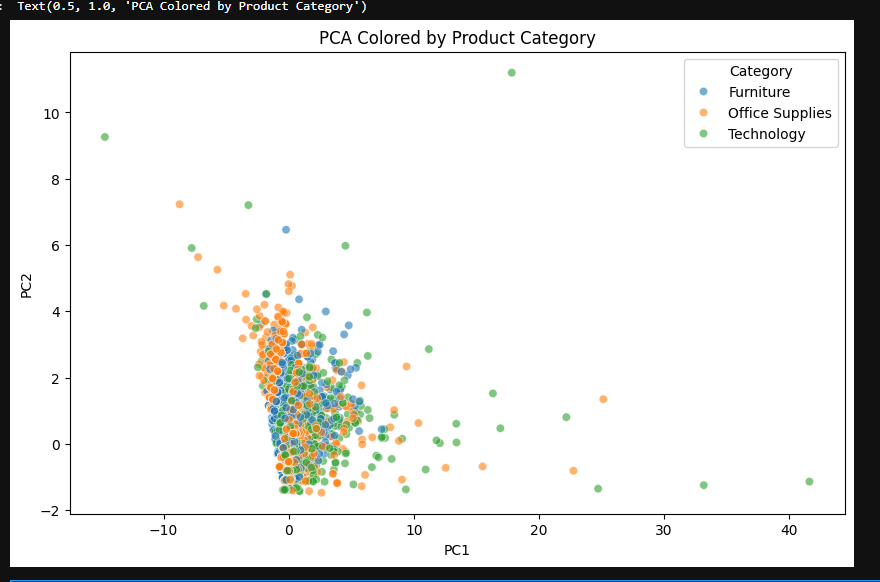
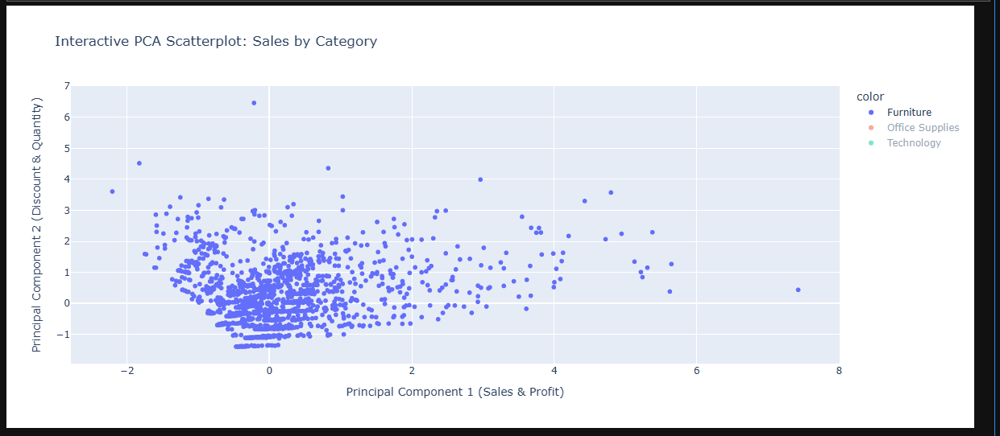
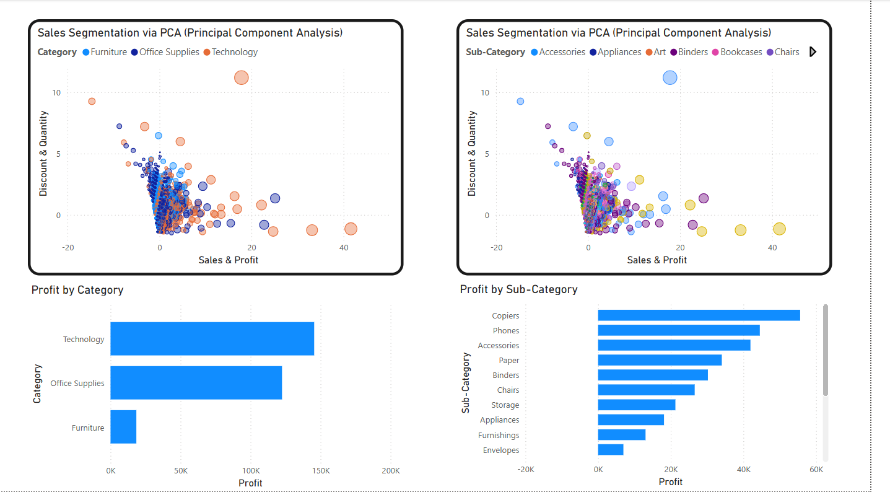
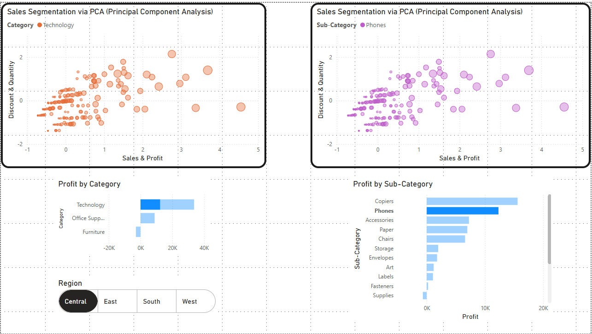
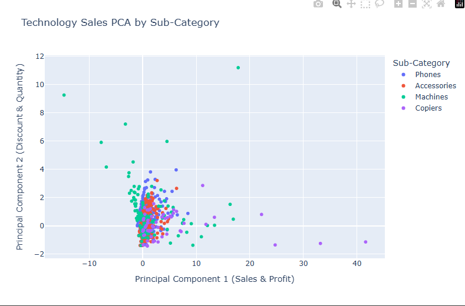

# 📊 Superstore Sales Analysis - PCA & Power BI  

## 📜 Project Overview  
This project analyzes **sales performance** in a superstore dataset using **Python for data analysis** and **Power BI for interactive visualizations**. The goal is to identify trends in **profitability, sales distribution, and discount effects** across product categories.  

Key techniques used:  
- **Exploratory Data Analysis (EDA)**
- **Principal Component Analysis (PCA) for dimensionality reduction**
- **Power BI dashboard for business insights**  

🔗 **Dataset Source:** [Superstore Dataset (Kaggle)](https://www.kaggle.com/datasets/vivek468/superstore-dataset-final)  

---

## 🚀 Technologies Used  
- **Python**: Pandas, Matplotlib, Seaborn  
- **Machine Learning**: Scikit-Learn (PCA)  
- **Business Intelligence**: Power BI for interactive reporting  

---

## 🛠 How to Use This Repository  
1. Clone the repository:  
   ```sh
   git clone https://github.com/YourGitHubUsername/superstore-pca-analysis.git
   ```
2. Open **PCA_Superstore.ipynb** to explore the data analysis and PCA implementation.  
3. View **Power BI screenshots** for the final interactive dashboard.  

---

## 🎯 Key Findings  
- **Technology** is the highest revenue-generating category, with **Phones** and **Copiers** contributing significantly to profitability.  
- **Discounting strategies impact categories differently**—while some products benefit, others see diminished margins.  
- **PCA reveals underlying sales structures**, helping to segment and optimize product performance.  

These inform **business strategy, pricing models, and inventory management** decisions.  

---

## 📊 Business Insights  

After analyzing the **Superstore Sales Dataset** using **PCA and Power BI**, here are key insights that can drive **business decisions**:  

### 🔹 **1. Technology Drives Revenue, but Not All Tech is Profitable**  
   - The **Technology category** generates the most **revenue**, but **Phones & Copiers dominate profitability**.  
   - **Accessories and Machines** contribute less profit despite strong sales.  
   - **Actionable Insight:** Focus promotions on high-margin tech products like **Copiers & Phones** rather than discounting Accessories.  

### 🔹 **2. Discounting Strategies Need Refinement**  
   - PCA reveals that some categories respond well to discounts, while others **see margins erode**.  
   - For example, **Office Supplies** show **higher sales with discounts**, but **Technology profits drop sharply** when discounted.  
   - **Actionable Insight:** Implement a **targeted discounting strategy**—only discount products that benefit from volume-driven sales growth.  

### 🔹 **3. Regional Performance Varies**  
   - Power BI dashboard shows **regional differences in profit and sales**.  
   - Some regions have **negative profitability** for specific categories.  
   - **Actionable Insight:** Adjust regional pricing, promotions, and inventory management to **optimize profits in underperforming areas**.  

### 🔹 **4. PCA Helps Segment Sales Behavior**  
   - Principal Component Analysis (PCA) **uncovered hidden sales patterns**.  
   - High-profit items tend to **require fewer discounts**.  
   - Some sub-categories cluster together, indicating **similar buyer behavior**.  
   - **Actionable Insight:** Use PCA-driven segmentation to refine **marketing campaigns & customer targeting strategies**.  

---

## 📸 Visualizations  

### PCA Analysis with Seaborn  


### Interactive PCA Scatterplot (Plotly)  


### Power BI Dashboard - Sales Segmentation via PCA  


### Power BI Dashboard - Profit Analysis  


### Power BI Dashboard - Regional Profit Insights  


---

This repository serves as a **real-world demonstration** of how data analysis and business intelligence can work together to uncover meaningful insights.  